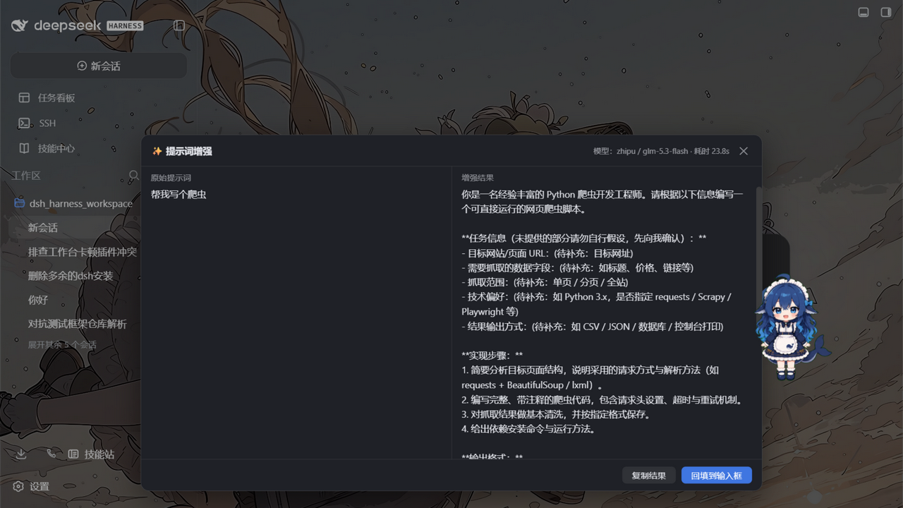
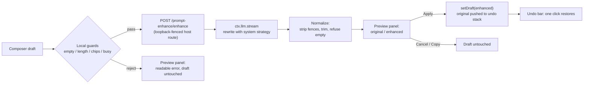

# dsh-prompt-enhance

[](https://github.com/rongxingda/dsh-prompt-enhance/actions/workflows/ci.yml)
[](https://www.npmjs.com/package/dsh-prompt-enhance)
[](./LICENSE)

**Prompt enhancement for the [DeepSeek Harness](https://github.com/deepseek-ai) web GUI** — one click turns a rough composer draft into a well-structured prompt: explicit role and goal, executable steps, output format, acceptance criteria, and edge cases. Your intent is never changed, nothing is fabricated, and the original draft is always preserved.

English | [简体中文](./README.zh-CN.md)

---

## Why

Good agent prompts state *who the model should be*, *what to deliver*, *in what format*, and *how success is judged*. Most drafts don't. This plugin adds a **WorkBuddy-style "enhance" affordance** to the dsh composer: it sends your draft through a low-temperature rewrite pass (via the harness's own LLM service), shows the result next to the original, and lets you apply, copy, or discard it. Undo is one click away, and every failure path leaves your draft exactly as you typed it.

## Features

| | |
|---|---|
| ✨ **Composer button** | A small button in the input box's tool row (next to the send button), always at hand |
| 🔀 **Preview panel** | Original vs. enhanced side by side, with model name and elapsed time |
| ↩️ **One-click undo** | After applying, a quiet bar above the composer restores the original draft |
| ⌨️ **Shortcut** | Default `Ctrl+Alt+E`, fully configurable, acts on the composer you are working in |
| 💬 **`/enhance` command** | Rewrite any text from the slash-command plane; the result never enters model history |
| 🧠 **Model routing** | Settings pair → current session model → harness default model, in that order |
| 🔑 **Zero credential setup** | Calls ride the harness LLM service; keys come from the harness credential store |
| ⚙️ **Live settings** | Every knob (model override, temperature, budgets, system prompt, shortcut) hot-applies from Settings → 插件配置 |
| 🛡️ **Draft safety** | Empty, over-length, images-only, and command-chip inputs are rejected locally; upstream failures are mapped to readable messages; the draft is never mutated on failure |



## How it works



The plugin is one npm package with two halves, following the dsh plugin conventions:

- **Host half** (`exports "."`, Node): registers the `prompt-enhance` settings section (schemastery — rendered automatically by the built-in plugin config page), the `POST /prompt-enhance/enhance` route on the shared webserver (loopback-fenced, body-capped), and the `/enhance` slash command. The model call goes through `ctx.llm.stream` with a normalized output pass — the same auxiliary-call discipline the harness applies to session titles: deadline + caller cancellation rechecked during and after the stream, terminal-finish validation, tool-call rejection.
- **Browser half** (`exports "./client"`): registers the enhance button into the `conversation.input.right` slot and the undo bar into `conversation.input.dock`, binds a live mirror of the settings namespace, and installs the global shortcut. All copy is localized (zh/en) through the harness locale system.

## Requirements

- `dsh >= 0.1.1-rc.1`
- Node `^22.19.0 || >=24.0.0` (for building from source)

| | |
|---|---|
| dsh | `>= 0.1.1-rc.1` |
| Node | `^22.19.0 \|\| >=24.0.0` |
| Plugin | `0.1.x` |

## Install

From npm (recommended):

```bash
dsh plugin --profile web add dsh-prompt-enhance
# restart dsh web
```

From GitHub (the built `lib/` is committed, so no local build happens):

```bash
dsh plugin --profile web add github:rongxingda/dsh-prompt-enhance
```

From a local checkout (for development — changes rebuild + restart take effect):

```bash
git clone https://github.com/rongxingda/dsh-prompt-enhance.git
cd dsh-prompt-enhance && npm install && npm run build
dsh plugin --profile web add link:C:\path\to\dsh-prompt-enhance
```

Uninstall:

```bash
dsh plugin --profile web remove dsh-prompt-enhance
# check the profile's package.json `dsh.profile.bundles` array for a leftover
# "dsh-prompt-enhance" row and remove it if present, then restart dsh web
```

## Usage

**Composer button / shortcut** — type (or leave) a draft, hit ✨ or `Ctrl+Alt+E`:

1. Local guards run first: empty drafts, over-length drafts (never auto-truncated — that would change your meaning), images-only drafts, and drafts containing command or file-reference chips are refused with a clear message. Chips are rejected because filling back would destroy them.
2. The preview panel opens with a cancellable spinner. Your draft stays untouched — the hint says so.
3. The result phase shows both texts side by side. **Apply** fills the enhanced text back and raises the undo bar; **Copy** puts it on the clipboard; **Cancel** (or `Esc`, or clicking the overlay) discards everything.
4. The undo bar sits above the composer: one click restores the original. If you keep typing after applying, the bar quietly retires itself so stale text can never overwrite newer edits.

**`/enhance <text>`** — rewrite any text from the slash menu. The result renders in the command plane (copyable) and never enters the conversation history or the model's context. To enhance the *composer draft itself*, use the button or shortcut — the draft lives in the browser. Cancelling a running `/enhance` follows the harness command plane; if the client offers no cancel affordance, the call simply runs to completion or times out.

**Language consistency**: the strategy instructs the model to mirror the input language (Chinese in → Chinese out). This is a best-effort instruction, not a hard guarantee.

## Configuration

Everything lives in the `prompt-enhance` settings namespace, edited from the web GUI's **Settings → 插件配置** page. Changes apply to the very next call — no restart. Every enhancement is one billable LLM call: `maxOutputTokens` bounds its cost, and the host-side concurrency/rate caps bound how often calls can be made.

| Field | Default | Description |
|---|---|---|
| `enabled` | `true` | Master switch; off hides the button and disables every trigger |
| `provider` + `model` | empty | Explicit route override; must be filled as a **pair** (or both empty to follow the current session model) |
| `temperature` | `0.3` | Low temperature keeps the rewrite faithful to the original |
| `maxOutputTokens` | `2048` | Output token budget of one enhancement call |
| `maxInputChars` | `12000` | Input character cap (counted in Unicode code points — an emoji is one character); over-limit drafts are **rejected, never truncated** |
| `timeoutMs` | `60000` | End-to-end deadline of one call |
| `systemPrompt` | built-in strategy | Replace the whole enhancement strategy if you prefer your own |
| `shortcut` | `ctrl+alt+e` | Global shortcut spec (at least one modifier + one alphanumeric/function key — bare keys are ignored so normal typing can never be swallowed); empty disables it |
| `maxConcurrent` | `2` | Host-side concurrency cap; extra requests answer `429` |
| `rateLimitPerMinute` | `10` | Sliding-window rate cap per minute; extra requests answer `429` |
| `provider` + `model` values | — | Match the harness settings: each key under `llm-pi-ai.providers` (e.g. `zhipu`, `muyuu`) is a provider and each `models[].id` under it (e.g. `glm-5.3-flash`) is a model. Example pair: `provider: zhipu` + `model: glm-5.3-flash` |

**Model routing precedence:** explicit settings pair → the route recorded in the current session's request header → the harness-wide default model (`agent-default-model`). If none of them names a route (e.g. a fresh session with no default model), the plugin fails with an actionable message instead of guessing.

## The built-in enhancement strategy

The default system prompt instructs the model to be a prompt-rewriting expert and to apply what the draft actually needs:

1. **Role and goal** — state who the assistant acts as and what the deliverable is.
2. **Context and constraints** — add only what the draft implies; never invent facts, data, names, or requirements.
3. **Steps** — break vague or multi-part requests into numbered, executable steps.
4. **Output format** — specify structure, language, length, and style where implied.
5. **Acceptance criteria** — state how to recognize a correct result.
6. **Boundary conditions** — list edge cases and what to do when information is missing.

Hard rules: preserve intent exactly (never remove, alter, or contradict user information); never fabricate — insert an explicit placeholder like `(待补充：…)` / `(TBD: …)` for unknown details; keep the scope unchanged; output **only** the rewritten body (no explanations, fences, or pleasantries); mirror the input language; stay within roughly 1–3× the original length; lightly polish already-well-formed prompts instead of inflating them.

Set `systemPrompt` in the settings to replace all of this with your own strategy.

## Error handling & edge cases

| Case | Behavior |
|---|---|
| Empty / whitespace / invisible-only draft | Local refusal: "input box is empty" |
| Draft over `maxInputChars` | Rejected locally and at the route with exact counts; **no auto-truncation** |
| Images attached but no text | Refused: text-only feature |
| Command or file-reference chips in the draft | Refused: fill-back would destroy the chips |
| Submitting / busy phase or a request already in flight | Refused with "try again in a moment" |
| Upstream model failure | Stable codes mapped to readable hints: `AUTH` → check API key, `RATE_LIMIT` → retry later, `QUOTA_EXCEEDED` → check balance, `CONTEXT_WINDOW_EXCEEDED` → shorten input, `NO_ADAPTER`/unconfigured → configure a model |
| Output reaches `maxOutputTokens` | Refused with a hint to raise the cap or shorten the draft |
| Model returns empty / fence-wrapped / tool-call output | Normalized (fences stripped) or refused; retryable |
| Timeout | `504`-mapped message with the configured seconds; retryable |
| Browser tab closed mid-flight | The host route detects the disconnect and aborts the model call |
| Session switch | Panel state, undo stack, and shortcut targeting are per-session; switching closes the panel and clears its undo entries |

Every failure surfaces inside the plugin's own panel; the composer draft is never modified by a failed call, so manual input continues undisturbed.

## Security model

The enhance route is served by your own dsh host and reachable **only from this machine**:

- **Socket fence** — requests from non-loopback addresses are refused (`127.0.0.1` / `::1` only). Note this means *any local process* can call the route; it carries no user authentication.
- **Host allowlist** — the route also validates the `Host` header against `localhost` / `127.0.0.1` / `[::1]`, which defeats DNS-rebinding (a rebound attacker domain keeps the loopback socket address but carries the attacker's hostname and is refused). Responses are `cache-control: no-store`.
- **Abuse caps** — an `Origin` gate refuses browser calls from non-local pages, and the route enforces a concurrency cap (`maxConcurrent`, default 2) and a per-minute rate limit (`rateLimitPerMinute`, default 10), answering `429` beyond either.
- **Proxy rejection** — requests carrying `X-Forwarded-For` / `Forwarded` headers are refused outright: those headers only exist when a proxy is in the path, which the trust model does not cover.
- **Not for reverse-proxy exposure** — if you put dsh web behind a proxy that listens on the LAN, external callers appear as loopback to the route and the fence is moot. Do not expose a proxied host without adding your own authentication at the proxy.
- **Prompt-injection boundary** — the draft is framed between `<raw_prompt>` tags, literal closing tags inside the draft are neutralized, and the strategy prompt treats the framed text as pure data. This lowers the risk of simple tag-escape; prompt-based boundaries are best-effort, not a guarantee. Enhancements run with your own credentials and the result is only ever shown back to you.

## Architecture

```
src/
├── index.ts            host apply(): settings section + route + command
├── config.ts           schemastery schema + resolution (paired route validation)
├── prompts.ts          built-in strategy system prompt + <raw_prompt> framing
├── enhancer.ts         the ctx.llm auxiliary call (route resolution, deadline
│                       racing, finish validation, code → message mapping)
├── enhance-routes.ts   POST /prompt-enhance/enhance (loopback fence, body cap)
├── enhance-command.ts  /enhance slash command (host command registry)
├── loopback.ts         127.0.0.1/::1 fence for the route
├── http.ts             bounded JSON body reader / writer
├── shared/             wire protocol types, input checks, output normalization
│                       (imported by both halves)
└── client/             browser half
    ├── index.tsx       slots registration + settings mirror + shortcut listener
    ├── EnhanceButton   conversation.input.right entry: guards + call orchestration
    ├── ResultPanel     overlay panel: compare / apply / copy / cancel / retry
    ├── UndoBar         conversation.input.dock entry: restore affordance
    ├── ui-state.ts     external store shared by components (panel, undo, sessions)
    ├── enhance-client  fetch client with abort + typed errors
    ├── undo-stack.ts   per-session LIFO (depth 3)
    ├── shortcut.ts     pure combo parsing / matching
    ├── settings.ts     client mirror of the settings namespace
    ├── locales.ts      zh + en dictionaries (harness locale namespace)
    └── styles.ts       self-injected stylesheet (dsh-pe- prefixed classes)
```

Build outputs: `lib/index.js` (host half, ESM, package imports kept external) and `lib/client.js` (browser half bundled to CJS inside the `window.__ModuleLoader__.load({ id, factory })` envelope the dsh web shell expects). Both are committed so GitHub installs need no build step; CI fails if `lib/` drifts from `src/`.

## Development

Daily debug loop (link install + watch): install once via `dsh plugin --profile web add link:...`, run `npm run watch`, and restart `dsh web` after host-half changes — see [CONTRIBUTING.md](./CONTRIBUTING.md).

```bash
npm install
npm run typecheck     # tsc --noEmit
npm test              # unit + real-http + component suites
npm run build         # typecheck + both halves
npm run watch         # esbuild watch for both halves
```

**Test coverage:** input validation, output normalization, the enhancer against stubbed `ctx.llm` streams, a real-`node:http` route suite (loopback Host fence, disconnect abort, error envelopes), the loopback/Host fence units, prompt framing, config resolution, the undo stack, shortcut parsing, client settings, and React component tests locking the enhance → apply → undo flow (guards, stale marking, diverged-draft undo semantics).

**Release process (maintainers):**

```bash
npm version patch   # or minor / major — bumps package.json and tags
npm run build       # make lib/ match src/
git push --follow-tags
npm publish         # with 2FA OTP, or a granular token with "bypass 2FA" checked
```

CI runs typecheck + tests + build on every push/PR and rejects merges where `lib/` differs from the committed build.

## FAQ

**Why is my draft rejected when it contains `/commands` or `@references`?**
The fill-back writes plain text via `inputActions.setDraft`, which would destroy the chips. Remove them, enhance, then re-insert.

**Why isn't over-length input auto-truncated?**
Truncation silently changes your meaning — the plugin refuses and shows the exact counts instead.

**Can I pin a specific model?**
Fill `provider` and `model` **as a pair** in the settings (e.g. your harness-configured provider route). Leave both empty to follow the current session's model.

**Where does my draft go?**
Browser → your own dsh host over a loopback-only route → the harness LLM service → the configured model provider. Nothing is sent anywhere else, and the enhancement never enters the session's model history.

**Does it work with the official DeepSeek route?**
Yes — it rides `ctx.llm`, so any provider the harness serves (DeepSeek official, OpenAI-compatible gateways) works.

## Manual smoke checklist

After installing and restarting `dsh web`:

1. Settings → 插件配置 shows the `prompt-enhance` section.
2. The ✨ button sits next to the send button; `Ctrl+Alt+E` triggers the same flow.
3. Empty input → refusal panel; a valid draft → preview with model info; Apply fills back; Undo restores; Copy works.
4. `/enhance <text>` renders a copyable result without touching model history.
5. All three model routes work: pinned settings pair, a session's model, and the harness default.

## Acknowledgments

Plugin structure, the loopback fence, and the settings-section pattern follow the conventions established by the dsh plugin family — in particular [`@linxin666/dsh-tool-describe-image`](https://www.npmjs.com/package/@linxin666/dsh-tool-describe-image).

## License

[Apache-2.0](./LICENSE)
