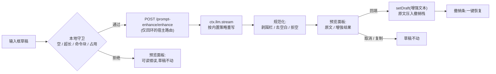

# dsh-prompt-enhance

[](https://github.com/rongxingda/dsh-prompt-enhance/actions/workflows/ci.yml)
[](https://www.npmjs.com/package/dsh-prompt-enhance)
[](./LICENSE)

**DeepSeek Harness Web GUI 的「提示词增强」插件** —— 一键把输入框里的草稿改写为结构化提示词:明确的角色与目标、可执行步骤、输出格式、验收标准、边界条件。不改变原意、不凭空编造需求,原文始终保留。

[English](./README.md) | 简体中文

---

## 为什么需要它

好的智能体提示词会讲清*让模型扮演谁*、*交付什么*、*以什么格式*、*怎样算合格*——而大多数草稿不会。本插件给 dsh 输入框加上 WorkBuddy 风格的「增强」入口:草稿经低温重写(走 harness 自带的 LLM 服务),结果与原文并排对比,你可以回填、复制或丢弃。撤销只需一键,且**任何失败路径都不会改动你输入的内容**。

## 功能一览

| | |
|---|---|
| ✨ **输入框按钮** | 工具栏内发送键旁的小按钮,随手可及 |
| 🔀 **对比预览面板** | 原文与增强结果左右并排,附模型名与耗时 |
| ↩️ **一键撤销** | 回填后输入框上方出现撤销条,一键恢复原文 |
| ⌨️ **快捷键** | 默认 `Ctrl+Alt+E` 可配置,作用于你正在使用的输入框 |
| 💬 **`/enhance` 命令** | 斜杠面板直接改写任意文本;结果不进入模型历史 |
| 🧠 **模型路由** | 设置成对覆盖 → 当前会话模型 → 全局默认模型,依次回退 |
| 🔑 **零凭据配置** | 调用走 harness LLM 服务,密钥来自 harness 凭据存储 |
| ⚙️ **配置热生效** | 模型覆盖、温度、预算、系统提示词、快捷键,全部在 设置 → 插件配置 即改即用 |
| 🛡️ **草稿安全** | 空输入、超长、仅图片、含命令块在本地拦截;上游失败映射为可读提示;失败绝不改动草稿 |


## 工作原理



插件是单个 npm 包、双半区结构,完全遵循 dsh 插件规范:

- **宿主半区**(`exports "."`,Node):注册 `prompt-enhance` 设置节(schemastery,由内置插件配置页自动渲染)、共享 webserver 上的 `POST /prompt-enhance/enhance` 路由(仅回环、限长),以及 `/enhance` 斜杠命令。模型调用走 `ctx.llm.stream` 并做规范化处理——与 harness 对会话标题相同的辅助调用纪律:超时与调用方取消在流过程中和结束后复查、终结 finish 校验、拒绝工具调用。
- **浏览器半区**(`exports "./client"`):把增强按钮注册进 `conversation.input.right` 插槽、撤销条注册进 `conversation.input.dock` 插槽,绑定设置命名空间的实时镜像,并安装全局快捷键。全部文案经 harness locale 系统提供中英双语。

## 环境要求

- `dsh >= 0.1.1-rc.2`
- 实测环境:`0.1.1-rc.2` 与 `0.1.2-alpha.3` 均已 boot 验证(插件层挂载、增强路由应答、客户端 bundle 构建通过;alpha 上走新版 `ctx.settings.installSection` 注册路径)。宿主 `@deepseek-ai/dsh-settings` 的注册 API 在两代之间有破坏性变更,插件按运行时探测自动适配,无需配置。
- Node `^22.19.0 || >=24.0.0`(仅从源码构建时需要)

| | |
|---|---|
| dsh | `>= 0.1.1-rc.2` |
| Node | `^22.19.0 \|\| >=24.0.0` |
| 插件 | `0.1.x` |

## 安装

从 npm(推荐):

```bash
dsh plugin --profile web add dsh-prompt-enhance
# 重启 dsh web
```

从 GitHub(构建产物 `lib/` 已随仓库提交,安装无需本地构建):

```bash
dsh plugin --profile web add github:rongxingda/dsh-prompt-enhance
```

从本地检出(开发用,改代码重建 + 重启即生效):

```bash
git clone https://github.com/rongxingda/dsh-prompt-enhance.git
cd dsh-prompt-enhance && npm install && npm run build
dsh plugin --profile web add link:C:\path\to\dsh-prompt-enhance
```

卸载:

```bash
dsh plugin --profile web remove dsh-prompt-enhance
# 检查 profile 的 package.json 中 `dsh.profile.bundles` 数组是否残留
# "dsh-prompt-enhance" 行,有则手动删除,然后重启 dsh web
```

## 使用方法

**输入框按钮 / 快捷键** —— 输入(或留着)草稿,点 ✨ 或按 `Ctrl+Alt+E`:

1. 先跑本地守卫:空草稿、超长草稿(**不自动截断**——截断会改变原意)、仅图片草稿、含命令或文件引用块的草稿,都会被拒绝并给出明确提示。引用块被拒是因为回填会破坏它们。
2. 预览面板打开,显示可取消的加载动画。此时草稿原封不动——面板上写明了这一点。
3. 结果阶段左右并排展示两份文本。**回填**把增强文本写回输入框并升起撤销条;**复制**进剪贴板;**取消**(`Esc` 或点击遮罩)丢弃一切。
4. 撤销条停在输入框上方:一键恢复原文。回填后你继续输入,撤销条会安静地自我退位——过期的原文永远不会覆盖你更新的编辑。撤销记录**只存在于当前页面内存**(每个会话最多 3 条),刷新页面、重启 Web 或切换会话后即失效。

**`/enhance <文本>`** —— 从斜杠菜单改写任意文本。结果在命令面板渲染(可复制),不进入会话历史与模型上下文。要增强**输入框里的草稿**请用按钮或快捷键——草稿在浏览器里。正在运行的 `/enhance` 取消跟随 harness 命令面板能力;客户端未提供取消入口时,调用会执行到完成或超时。

**语言一致性**:重写策略默认要求模型保持输入语言(中文进中文出)——尽力而为的约束,无法严格保证。

## 配置

全部配置位于 `prompt-enhance` 设置命名空间,在 Web GUI 的 **设置 → 插件配置** 页编辑。改动作用于下一次调用——无需重启。每次增强都是一次计费的 LLM 调用——`maxOutputTokens` 约束单次成本,并发/限流字段约束调用频率。

| 字段 | 默认 | 说明 |
|---|---|---|
| `enabled` | `true` | 总开关;关闭隐藏按钮并停用所有触发方式 |
| `provider` + `model` | 空 | 显式路由覆盖;必须**成对**填写(或都留空以跟随当前会话模型) |
| `temperature` | `0.3` | 低温使改写更忠实于原意 |
| `maxOutputTokens` | `2048` | 单次增强调用的输出 token 预算 |
| `maxInputChars` | `12000` | 输入字符数上限(按 Unicode 字符统计,不是 token 数;一个 emoji 算一个字符);超限**拒绝而不截断** |
| `timeoutMs` | `60000` | 单次调用的端到端超时 |
| `systemPrompt` | 内置策略 | 自定义增强策略文本;与内置策略如何组合见 `strategyMode` |
| `strategyMode` | `replace-default` | 自定义策略的组合方式:`replace-default` **整体替换**内置策略(向后兼容,但「不改变原意、不编造、只输出正文、镜像输入语言」等硬性约束不会自动保留,需自行写入);`extend-default` 把自定义文本**追加在内置策略之后**,硬性约束继续生效 |
| `shortcut` | `ctrl+alt+e` | 快捷键规格(至少一个修饰键 + 单个字母/数字/功能键——纯裸键会被忽略,绝不会吞掉正常打字);留空禁用 |
| `maxConcurrent` | `2` | **单个 Host 进程内**的并发上限;超出的请求返回 `429`(`concurrency-limit`)。浏览器 UI 因单预览面板天然只允许 1 个在途请求,此上限主要保护 `/enhance` 命令入口与多客户端调用 |
| `rateLimitPerMinute` | `10` | **单个 Host 进程内**的每分钟滑动窗口限流,只统计**成功完成**的增强——失败(超时 / 上游错误 / 取消)不消耗窗口,连续失败不会把自己限流;超出的请求返回 `429`(`rate-limit`),响应附 `Retry-After` 秒数 |
| `provider` + `model` 取值 | — | 与 harness 设置一致:设置文件 `llm-pi-ai.providers` 下的键就是 provider(如 `zhipu`、`muyuu`),其 `models[].id` 就是 model(如 `glm-5.3-flash`)。示例:`provider: zhipu` + `model: glm-5.3-flash` |

**模型路由优先级:** 设置成对覆盖 → 当前会话请求头中记录的路由 → 全局默认模型(`agent-default-model`)。三者都指不出路由时(例如全新会话且无默认模型),插件给出可操作的报错而不是乱猜。

## 内置增强策略

默认系统提示词让模型扮演提示词重写专家,按草稿的实际需要施加:

1. **角色与目标** —— 写明助手扮演谁、交付物是什么。
2. **背景与约束** —— 只补全草稿可推断的信息;绝不编造事实、数据、名称或需求。
3. **步骤** —— 把模糊或多头需求拆成编号、可执行的步骤。
4. **输出格式** —— 在有暗示处指明结构、语言、长度与风格。
5. **验收标准** —— 写明怎样判断结果正确。
6. **边界条件** —— 列出边界情况与信息缺失时的做法。

硬性规则:精确保留原意(不删除、不篡改、不与用户信息冲突);绝不编造——未知细节插入显式占位符如 `(待补充:…)` / `(TBD: …)`;保持任务范围不变;**只输出**改写后的正文(无解释、无围栏、无客套);镜像输入语言;长度约为原文 1–3 倍;已经成形的提示词只做轻度润色而不注水。

在设置中填写 `systemPrompt` 即可自定义策略,组合方式由 `strategyMode` 决定:默认 `replace-default` 是**完全替换**——内置策略中的安全约束(不改变原意、不编造、只输出正文、镜像输入语言、原文视为纯数据)不会自动保留,自定义策略需要自行包含这些约束;改为 `extend-default` 则把你的文本追加在内置策略之后,硬性约束继续生效。

## 异常与边界

| 情形 | 行为 |
|---|---|
| 空 / 纯空白 / 零宽字符草稿 | 本地拒绝:「输入框为空」 |
| 草稿超过 `maxInputChars` | 本地与路由双重拒绝并给出精确字符数;**不自动截断** |
| 只附加了图片没有文本 | 拒绝:仅支持文本 |
| 草稿含命令 / 文件引用块 | 拒绝:回填会破坏引用块 |
| 提交中 / 占用阶段 / 已有请求在途 | 拒绝并提示「稍后再试」 |
| 每分钟次数超限 | `429`（`rate-limit`），响应携带 `Retry-After` 秒数，宿主消息给出精确等待时长;窗口只统计成功完成的调用——失败不消耗窗口 |
| 并发已满 | `429`（`concurrency-limit`），无 `Retry-After`——空出的时机不可预测，等一个在途调用结束即可 |
| 上游模型失败 | 稳定错误码映射为可读提示:`AUTH` → 检查 API Key、`RATE_LIMIT` → 稍后重试、`QUOTA_EXCEEDED` → 检查余额、`CONTEXT_WINDOW_EXCEEDED` → 精简输入、`NO_ADAPTER`/未配置 → 先配置模型 |
| 输出达到 `maxOutputTokens` | 拒绝并提示调大上限或精简原文 |
| 模型返回空 / 围栏包裹 / 工具调用 | 规范化(剥围栏)或拒绝;可重试 |
| 超时 | 映射为 `504` 的提示并给出配置秒数;可重试 |
| 浏览器中途关闭 | 宿主路由侦测连接断开,立即中止模型调用 |
| 切换会话 | 面板状态、撤销栈、快捷键目标均按会话隔离;切换即关闭面板并清理撤销记录 |

所有失败只出现在插件自己的面板里;失败的调用绝不修改输入框草稿,手动输入不受任何干扰。

## 错误码与本地化

宿主路由返回的结构化错误形如 `{ code, message?, params? }`:主文案由浏览器按 `code` + `params` 从当前语言字典渲染,`message` 只是可选的诊断细节(如模型服务商的原始报错、配置错误原文),原样展示在主文案下方。`/enhance` 命令平面没有 locale 字典,由宿主侧的同源渲染函数直接产出中文文本。

| 错误码 | HTTP 状态 | 浏览器主文案(字典键) | 参数 |
|---|---|---|---|
| `rejected` | 403 / 413 / 415 / 422 | `error.rejected` 通用;携带 `{ count, max }` 时复用 `error.tooLong` | 超长输入: `{ count, max }` |
| `rate-limit` | 429 | `error.rateLimit` | `{ limit, retryAfterSeconds }` |
| `concurrency-limit` | 429 | `error.concurrencyLimit` | `{ max }` |
| `timeout` | 504 | `error.timeout` | `{ seconds }` |
| `unconfigured` | 409 | `error.unconfigured` | — |
| `upstream` | 502 | `error.upstream` 通用;携带 `reason` 时用 `error.upstream.{reason}`(如 `auth` / `quota` / `rateLimit` / `empty` / `contextWindow` / `toolCall` / `maxTokens` / `invalidCredential`) | `{ reason }` |
| `internal` | 500 / 502 | `error.internal` | — |

## 故障排查

**按钮不出现 / 快捷键无响应**
设置 → 插件配置 → `prompt-enhance` 节的 `enabled` 是否为 `true`;插件是否成功安装(`dsh plugin --profile web list`)并重启了 `dsh web`;浏览器控制台是否有插件应用报错。

**「尚未确定增强用的模型」**
插件遵循设置成对覆盖 → 当前会话模型 → 全局默认模型的路由优先级,三者都为空时无法调用。在设置中成对填写 `provider`/`model`,或先在当前会话发一条消息让会话带上模型路由。检查 `agent-default-model` 设置节是否配置。

**「鉴权失败」**
`message` 细节行会带出具体原因(如 401)。检查对应 provider 在 harness 凭据存储中的 API Key;配额/余额问题对应 `quota` 提示。

**连续失败后立刻被限流(429)**
不应发生——限流窗口只统计成功调用,失败不消耗窗口。若仍遇到,确认同时挂载了多个 profile / 多进程(各自独立计数会叠加),或 `rateLimitPerMinute` 配置过低。

**结果不理想(编造、丢要求、格式乱)**
`strategyMode` 为 `replace-default` 时自定义 `systemPrompt` 会整体替换内置策略——内置的「不编造、只输出正文、镜像输入语言」等硬性约束不会自动保留,请自行写入;或改用 `extend-default`。

**升级后行为变了**
0.1.6 起宿主错误不再携带中文主文案,浏览器端按错误码本地化渲染(非中文界面不再混入中文);`rate-limit` 窗口改为只统计成功调用。升级后无需改配置。

## 安全模型

增强路由由你自己的 dsh 宿主提供服务,**仅限本机访问**:

- **套接字栅栏** —— 非回环地址(`127.0.0.1` / `::1` 之外)的请求一律拒绝。注意这意味着*本机任意进程*都可以调用该路由;路由本身不带用户鉴权。
- **Host 白名单** —— 路由同时校验 `Host` 头是否为 `localhost` / `127.0.0.1` / `[::1]`,可防御 DNS 重绑定(重绑定的攻击者域名虽然落在回环套接字上,但携带的是攻击者主机名,会被拒绝)。响应均为 `cache-control: no-store`。
- **滥用上限** —— `Origin` 门拒绝来自非本地页面的浏览器调用;路由还执行并发上限(`maxConcurrent`,默认 2)与每分钟限流(`rateLimitPerMinute`,默认 10),超限返回 `429`。这两项计数保存在**单个宿主进程的内存中**——多进程、cluster 或多个 profile 同时挂载时各自独立计数,全局上限会被突破;本插件只支持单进程部署,也不提供共享限流存储。
- **代理请求拒绝** —— 携带 `X-Forwarded-For` / `Forwarded` 头的请求直接拒绝:这些头只会在链路上存在代理时出现,而代理场景不在本路由的信任模型内。
- **请求级超时由宿主与 Node 兜底** —— 插件层只限制 body 字节数(含 Content-Length 快速拒绝)与单次模型调用的 `timeoutMs`;连接级超时(headers timeout / request timeout / keep-alive)是共享 `http.Server` 的 server 级配置,插件不覆盖,由宿主与 Node 默认值(headers 60 秒 / request 300 秒)兜底。
- **不要经反向代理暴露** —— 若把 dsh web 放在监听局域网的代理后面,外部调用者在路由看来就是回环地址,栅栏形同虚设。除非在代理层自行加鉴权,否则不要暴露。
- **提示注入边界** —— 草稿被框在 `<raw_prompt>` 标签之间,草稿内的字面闭合标签会被中和,策略提示词把框内文本视为纯数据——降低简单标签逃逸的风险;基于提示词的边界是尽力而为,并非完整防护。增强只使用你自己的凭据,结果也只回显给你本人。

## 架构

```
src/
├── index.ts            宿主 apply():设置节 + 路由 + 命令
├── config.ts           schemastery 模式 + 解析校验(成对路由)
├── prompts.ts          内置策略系统提示词 + <raw_prompt> 框架
├── enhancer.ts         ctx.llm 辅助调用(路由解析、超时竞速、finish 校验、
│                       结构化错误 code+params + 宿主侧渲染)
├── enhance-routes.ts   POST /prompt-enhance/enhance(回环栅栏、限长)
├── enhance-command.ts  /enhance 斜杠命令(宿主命令注册表)
├── loopback.ts         路由的 127.0.0.1/::1 栅栏
├── http.ts             限长 JSON body 读取 / 写出
├── shared/             传输协议类型、输入校验、输出规范化(两端共用)
└── client/             浏览器半区
    ├── index.tsx       插槽注册 + 设置镜像 + 快捷键监听
    ├── EnhanceButton   conversation.input.right 条目:守卫链 + 调用编排
    ├── ResultPanel     浮层面板:对比 / 回填 / 复制 / 取消 / 重试
    ├── UndoBar         conversation.input.dock 条目:恢复入口
    ├── ui-state.ts     组件共享的外部 store(面板、撤销、会话注册表)
    ├── enhance-client  fetch 客户端(可中止 + 类型化错误)
    ├── undo-stack.ts   按会话的 LIFO 栈(每会话深度 3,全局 60 条,LRU 淘汰)
    ├── shortcut.ts     纯函数的组合键解析 / 匹配
    ├── settings.ts     设置命名空间的客户端镜像
    ├── locales.ts      中英文字典(harness locale 命名空间)
    └── styles.ts       自注入样式表(dsh-pe- 前缀类名)
```

构建产物:`lib/index.js`(宿主半区,ESM,包引用保持外部)与 `lib/client.js`(浏览器半区,打包为 CJS 并包进 dsh web 壳要求的 `window.__ModuleLoader__.load({ id, factory })` 信封)。两者都随仓库提交,因此 GitHub 直装无需构建;CI 会在 `lib/` 与 `src/` 不一致时拒绝合并。

## 开发

日常调试闭环(link 安装 + watch):先用 `dsh plugin --profile web add link:...` 装一次,再挂 `npm run watch`;宿主半区改动需重启 `dsh web`——详见 [CONTRIBUTING.md](./CONTRIBUTING.md)。

```bash
npm install
npm run typecheck     # tsc --noEmit
npm test              # 单元 + 真实 HTTP + 组件测试套件
npm run build         # 类型检查 + 双半区构建
npm run watch         # esbuild 监听构建双半区
```

**测试覆盖:** 输入校验(空 / 零宽字符 / 超长)、输出规范化(剥围栏、折行、拒空)、以桩 `ctx.llm` 流驱动的增强器(正常路径、AUTH/NO_ADAPTER/max-tokens 终结、空输出、挂起流失超时、预中止的调用方、路由优先级)、路由的真实 `node:http` 端到端套件(回环栅栏、方法守卫、畸形 body、结构化错误信封、停用开关)、撤销栈、快捷键解析与匹配、配置解析、客户端设置解码器。

**发版流程(维护者):**

```bash
npm version patch   # 或 minor / major —— 更新 package.json 并打 tag
npm run build       # 让 lib/ 与 src/ 一致
git push --follow-tags
npm publish         # 带 2FA OTP,或使用勾选了 "bypass 2FA" 的细粒度令牌
```

CI 在每次 push/PR 上运行类型检查 + 测试 + 构建,并在 `lib/` 与已提交构建不一致时拒绝合并。

## FAQ

**为什么草稿里有 `/命令` 或 `@引用` 时被拒绝?**
回填通过 `inputActions.setDraft` 写纯文本,会破坏引用块。先移除它们,增强后再插回。

**为什么不自动截断超长输入?**
截断会无声地改变你的原意——插件宁可拒绝并给出精确字符数。

**能固定用某个模型吗?**
在设置中**成对**填写 `provider` 与 `model`(例如 harness 已配置的 provider 路由)。都留空则跟随当前会话模型。

**我的草稿会被发到哪里?**
浏览器 → 你自己的 dsh 宿主(仅回环路由)→ harness LLM 服务 → 配置的模型服务商。不会发往其他任何地方,增强行为也绝不进入会话的模型历史。

**官方 DeepSeek 路由能用吗?**
能——调用走 `ctx.llm`,harness 支持的所有 provider(DeepSeek 官方、OpenAI 兼容网关)都可用。

## 安装后手工冒烟清单

安装并重启 `dsh web` 后:

1. 设置 → 插件配置 出现 `prompt-enhance` 配置节。
2. 发送键旁出现 ✨ 按钮;`Ctrl+Alt+E` 触发相同流程。
3. 空输入 → 拒绝面板;有效草稿 → 预览含模型信息;回填生效;撤销恢复;复制可用。
4. `/enhance <文本>` 输出可复制结果,且不进入模型历史。
5. 三种模型路由都通:设置成对覆盖、会话模型、全局默认模型。

## 致谢

插件结构、回环栅栏与设置节模式遵循 dsh 插件家族的既有惯例——特别是 [`@linxin666/dsh-tool-describe-image`](https://www.npmjs.com/package/@linxin666/dsh-tool-describe-image)。

## 许可证

[Apache-2.0](./LICENSE)
